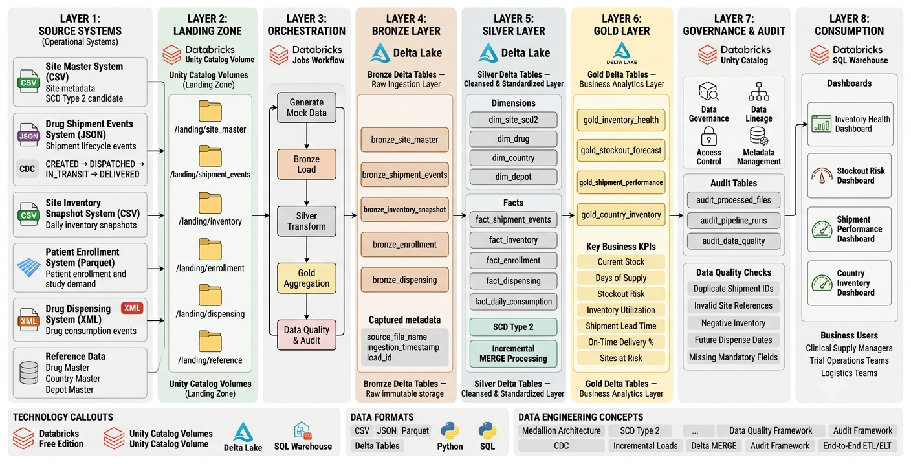

# Clinical Trial Supply Chain & Drug Inventory Intelligence Platform

## Overview
An end-to-end Data Engineering project built on Databricks to simulate and analyze clinical trial supply chain operations using a modern Lakehouse architecture. The platform ingests data from multiple operational systems, processes it through Bronze, Silver, and Gold layers, and delivers business-ready insights through Databricks SQL dashboards.

### Business Context
Clinical trial sites receive investigational drugs from regional depots, enroll patients into studies, and dispense drug kits throughout the trial lifecycle. Sponsors require visibility into inventory levels, shipment performance, consumption patterns, and site-level stockout risks to ensure uninterrupted trial execution. This project demonstrates how Data Engineering can be used to transform operational healthcare supply chain data into actionable analytics.

### Key Business Outcomes
* **Identify sites at risk of inventory stockouts**
* **Monitor shipment delays and logistics performance**
* **Track inventory position across countries and regions**
* **Analyze drug consumption trends**
* **Generate replenishment recommendations**
* **Deliver operational supply chain KPIs**

---

## Architecture



The solution follows a Medallion Architecture pattern implemented using Delta Lake and Databricks.

```
Source Systems
      │
      ▼
Landing Zone
      │
      ▼
Bronze Layer (Raw Delta Tables)
      │
      ▼
Silver Layer (Curated Dimensions & Facts)
      │
      ▼
Gold Layer (Business Marts & KPIs)
      │
      ▼
Databricks SQL Dashboards
```

---

## Source Systems

| Source System | Format | Purpose |
| :--- | :--- | :--- |
| **Site Master** | CSV | Clinical trial site metadata |
| **Patient Enrollment** | Parquet | Patient enrollment and study participation |
| **Drug Dispensing** | XML | Drug kit dispensing transactions |
| **Site Inventory Snapshot** | CSV | Inventory levels and stock positions |
| **Shipment Events** | JSON | Shipment lifecycle and logistics events |

### Reference Data
* Drug Master
* Country Master
* Depot Master

---

## Project Structure

```text
Clinical_Trial_Supply_Chain/
│
├── generator/
│   ├── generator.py
│   ├── site_generator.py
│   ├── enrollment_generator.py
│   ├── dispensing_generator.py
│   ├── inventory_generator.py
│   ├── shipment_generator.py
│   └── generator_state.json
│
├── landing/
│   ├── site_master/
│   ├── shipment_events/
│   ├── inventory/
│   ├── enrollment/
│   └── dispensing/
│
├── reference_data/
│   ├── drug_master.csv
│   ├── country_master.csv
│   └── depot_master.csv
│
├── bronze/
├── silver/
├── gold/
│
└── docs/
    └── images/
```

---

## Data Engineering Implementation

### Bronze Layer
*Raw ingestion layer preserving source fidelity.*

* **Key Characteristics:**
  * Incremental file ingestion
  * Append-only Delta tables
  * Source metadata capture
  * Load auditing & processed-file tracking
  * No business transformations

* **Operational Source Tables:** `bronze_site_master`, `bronze_shipment_events`, `bronze_inventory_snapshot`, `bronze_enrollment`, `bronze_dispensing`
* **Reference Tables:** `bronze_drug_master`, `bronze_country_master`, `bronze_depot_master`
* **Operational Control Tables:** `bronze_processed_files`, `bronze_load_audit`

### Silver Layer
*Curated and standardized business layer.*

* **Dimensions:** `dim_site_scd2`, `dim_country`, `dim_depot`, `dim_drug`, `dim_patient`
* **Facts:** `fact_shipment_events`, `fact_shipment_current`, `fact_inventory`, `fact_dispensing`, `fact_daily_consumption`
* **Key Processing Implemented:**
  * SCD Type 2 historical tracking
  * CDC-style shipment processing
  * Inventory availability calculations
  * Shipment lead-time calculations
  * Daily consumption aggregations
  * Business-rule standardization

### Gold Layer
*Business-facing analytical marts designed for reporting and dashboarding.*

* **Gold Tables:** `gold_stockout_risk`, `gold_replenishment_recommendation`, `gold_country_inventory`, `gold_shipment_delay_monitoring`, `gold_depot_performance`, `gold_supply_chain_kpi`

---

## Incremental Processing & CDC

### Incremental Processing
The Bronze layer processes only newly arrived files by maintaining metadata-driven ingestion tracking. This prevents reprocessing previously loaded files while supporting continuous batch ingestion.

### Slowly Changing Dimension (SCD Type 2)
Implemented for clinical trial sites to preserve historical changes.
* **Tracked attributes:** Site Status, Site Manager
* Enables both current-state and historical reporting.

### Change Data Capture (CDC)

Shipment events simulate real-world logistics workflows:

CREATED → DISPATCHED → IN_TRANSIT → DELIVERED

Historical events are retained while a separate current-state table provides the latest shipment status.

---

## Data Quality & Validation

Validation checks are incorporated throughout the pipeline to improve reliability and consistency:
* Schema validation
* Data type validation
* Duplicate detection
* Null-value checks
* Inventory consistency checks
* Shipment lifecycle validation
* Business-rule verification

---

## Key Business KPIs Delivered

* **Site Stockout Risk:** Identifies sites likely to exhaust inventory based on current stock levels and consumption trends.
* **Inventory Coverage Days:** Calculates estimated days of supply remaining for each site and drug combination.
* **Shipment Delay Monitoring:** Tracks delayed shipments and delivery performance.
* **Country Inventory Health:** Provides inventory visibility across countries and regions.
* **Depot Performance:** Measures depot operational efficiency through delivery metrics and lead times.
* **Replenishment Recommendations:** Generates inventory replenishment recommendations based on stock levels and reorder thresholds.

---

## Pipeline Orchestration

The platform is designed for automated execution using Databricks Jobs.

```text
Source Data Generation
          │
          ▼
Bronze Ingestion
          │
          ▼
Silver Transformations
          │
          ▼
Gold Aggregations
          │
          ▼
Dashboard Refresh
```
*Task dependencies ensure successful completion of upstream layers before downstream execution.*

---

## Dashboards


* **Executive KPI Dashboard:** Provides an operational overview of active sites, active patients, total inventory, total shipments, delayed shipments, and stockout risk sites.
* **Stockout Risk Dashboard:** Answers which sites are at risk of running out of inventory.
* **Replenishment Dashboard:** Answers which sites require inventory replenishment and by how much.
* **Country Inventory Dashboard:** Answers how inventory is distributed across countries and regions.
* **Shipment Monitoring Dashboard:** Answers which shipments are delayed and where operational bottlenecks occur.
* **Depot Performance Dashboard:** Answers how efficiently depots are servicing clinical trial sites.

---

## Technology Stack

| Component | Technology |
| :--- | :--- |
| **Data Platform** | Databricks |
| **Processing Engine** | Apache Spark |
| **Storage Layer** | Delta Lake |
| **Programming Language** | Python |
| **Query Engine** | SQL |
| **Governance** | Unity Catalog |
| **Visualization** | Databricks SQL |
| **Data Formats** | CSV, JSON, XML, Parquet |

---

## Technical Highlights

* Designed a multi-source clinical trial supply chain simulation platform.
* Implemented a Medallion Lakehouse architecture using Bronze, Silver, and Gold layers.
* Processed heterogeneous source formats including CSV, JSON, XML, and Parquet.
* Built SCD Type 2 dimensions for historical site tracking.
* Implemented CDC-style shipment event processing.
* Developed business-facing analytical marts for inventory and logistics analytics.
* Automated end-to-end execution using Databricks Jobs.
* Delivered dashboard-ready datasets supporting operational decision-making.

---

## Future Enhancements

* Real-time event ingestion using streaming pipelines
* Automated stockout risk alerting
* Forecast-based replenishment planning
* Advanced supply chain optimization
* Integration with external logistics systems
* Near real-time operational monitoring

---

## Author

Project focused on demonstrating Lakehouse architecture, incremental processing, CDC, SCD Type 2 implementation, dimensional modeling, Delta Lake best practices, and Databricks orchestration and analytics.